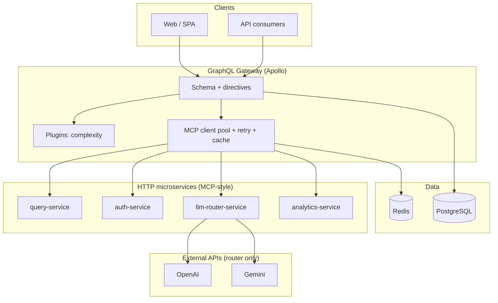
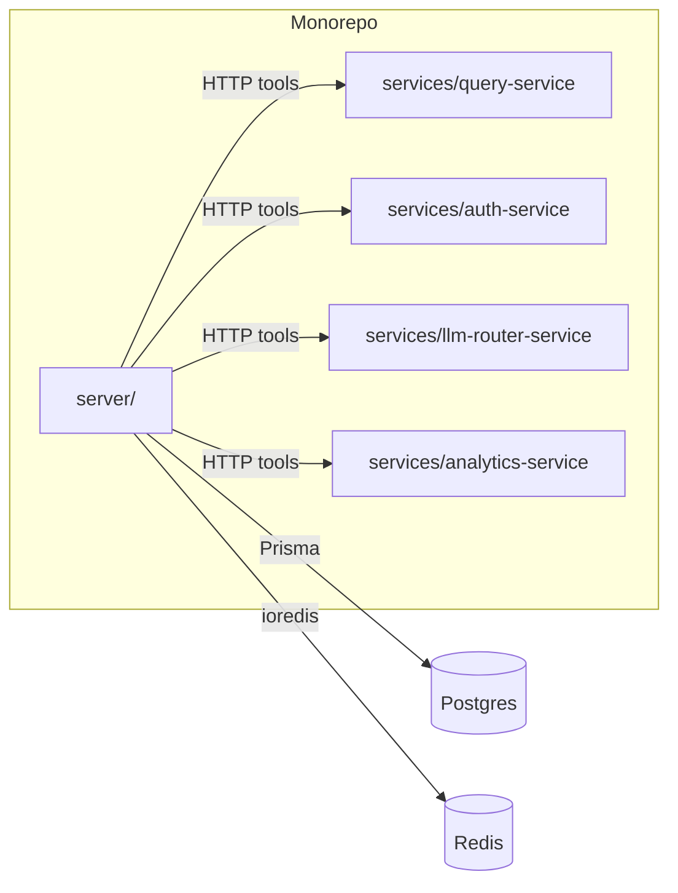
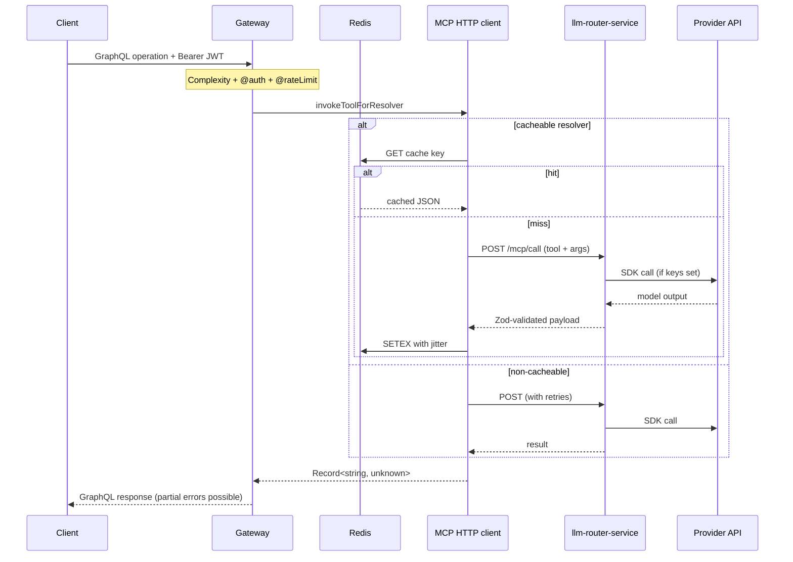

# QueryBridge

**A schema-first GraphQL gateway that routes privileged work (LLM, analytics, identity-adjacent reads) through a bounded “tool” layer—HTTP MCP-style microservices—with retries, cache, complexity limits, and optional RS256 JWTs.**

This monorepo is the reference implementation aligned with the platform intent described in `CLAUDE (1).md` and `SKILLS (1).md`. It is designed to be **reviewable**, **testable**, and **incrementally hardenable** (stub → HTTP → real keys → production infra).

---

## Table of contents

- [Why QueryBridge exists](#why-querybridge-exists)
- [Architecture](#architecture)
  - [System context](#system-context)
  - [Containers & data flow](#containers--data-flow)
  - [Request path (happy path)](#request-path-happy-path)
- [Repository layout](#repository-layout)
- [Tech stack](#tech-stack)
- [Local development](#local-development)
- [Configuration](#configuration)
- [GraphQL surface area](#graphql-surface-area)
- [MCP-style HTTP contract](#mcp-style-http-contract)
- [Security model](#security-model)
- [Testing & quality gates](#testing--quality-gates)
- [CI/CD](#cicd)
- [Contributing & pull requests](#contributing--pull-requests)
- [Roadmap & known gaps](#roadmap--known-gaps)
- [License](#license)

---

## Why QueryBridge exists

| Problem | How QueryBridge addresses it |
|--------|------------------------------|
| LLM calls scattered across services | **Single choke point**: gateway → `llm-router-service` only; ESLint blocks direct SDK usage elsewhere |
| Unbounded GraphQL cost | **AST-based complexity plugin** + `@complexity` on expensive fields |
| Thundering herd / abuse | **`@rateLimit`** wrapper (per user + field) for sensitive operations |
| Partial upstream failure | **Per-field errors** with partial data (GraphQL semantics) + **retries** on transient MCP failures |
| Cache correctness vs speed | **Cache-aside** with TTL jitter; **Redis** when available, **in-memory fallback** when not |
| Identity & persistence | **Prisma + PostgreSQL** for users, sessions, preferences, query logs; **DataLoader** to reduce N+1 |

---

## Architecture

### System context

Clients (web, mobile, BFF) speak **GraphQL** to the gateway. The gateway does **not** call OpenAI/Gemini directly—it delegates to **microservices** over HTTP using a small, explicit tool registry.



### Containers & data flow



**Transport modes**

| `MCP_TRANSPORT_MODE` | Behavior |
|---------------------|----------|
| `stub` | In-process mocks—fast unit/integration tests, no sidecars |
| `http` | Real `fetch` to `*_SERVICE_URL`—local full stack or deployed env |

### Request path (happy path)



---

## Repository layout

```
.
├── server/                      # GraphQL gateway (Apollo + Prisma + Redis)
│   ├── prisma/
│   │   └── schema.prisma        # Users, sessions, preferences, query_logs
│   ├── src/
│   │   ├── schema/*.graphql     # Schema-first SDL + directives
│   │   ├── resolvers/           # Thin resolvers; auth + domain
│   │   ├── mcp/                 # Client pool, HTTP transport, retry, cache
│   │   ├── middleware/          # JWT, complexity, rate limit
│   │   ├── loaders/             # DataLoader batching
│   │   └── cache/               # Redis + fallback
│   └── prisma.config.ts         # Prisma 7 datasource URL (not in .graphql schema file)
├── services/
│   ├── query-service/           # Health / probe MCP tools
│   ├── auth-service/            # Viewer-style stub (HTTP MCP)
│   ├── analytics-service/       # Summary stub
│   └── llm-router-service/      # Zod + OpenAI / Gemini SDKs (only place allowed)
├── tests/
│   ├── unit/                    # Focused pure behavior tests
│   └── integration/             # Gateway + injected MCP pool
├── scripts/
│   └── smoke-http.sh            # E2E: build, ports, GraphQL, teardown
├── .github/workflows/           # CI + deploy scaffolding
├── docker-compose.yml           # Postgres 16 + Redis 7
├── eslint.config.js             # Ban direct LLM SDK usage outside router
└── .env.example
```

---

## Tech stack

| Layer | Choices | Notes |
|-------|---------|--------|
| API | Apollo Server 4, GraphQL 16 | Standalone server; plugins for complexity |
| Schema | `@graphql-tools/schema`, SDL files | `@auth`, `@rateLimit`, `@complexity` |
| Persistence | Prisma 7, PostgreSQL 16 | Gateway-owned DB for users/sessions/prefs/logs |
| Cache | `ioredis`, Redis 7 | Prefix per `REDIS_ENV_PREFIX`; fallback `Map` |
| Auth | `jose` (RS256) | Access JWT verify; register/login/refresh in mutations |
| Resilience | Exponential backoff + jitter | `withRetries` around MCP calls |
| LLM | `openai`, `@google/generative-ai` | **Only** in `llm-router-service` |
| Testing | Vitest | Unit + integration + optional smoke script |
| Runtime | Node ≥ 20, TypeScript 5.9, `tsx` | |

---

## Local development

### Prerequisites

- **Node.js** ≥ 20  
- **Docker** (for Postgres + Redis)  
- Optional: **OpenAI** / **Gemini** API keys for non-stub LLM responses  

### Bootstrap

```bash
npm install
cp .env.example .env
docker compose up -d postgres redis
```

### Database

Prisma client generation and migrations (from repo root):

```bash
npm run db:generate
npm run db:migrate          # creates/applies dev migrations
# production-style:
npm run db:migrate:deploy
```

> **Note:** Commit initial migration files under `server/prisma/migrations/` once created so `prisma migrate deploy` succeeds in CI and staging.

### Run processes

Terminal multiplexing recommended (`tmux`, IDE multi-run, or `overmind`):

| Process | Command |
|---------|---------|
| Gateway | `npm run dev:gateway` |
| Query service | `npm run dev:query-service` |
| Auth service | `npm run dev:auth-service` |
| Analytics | `npm run dev:analytics-service` |
| LLM router | `npm run dev:llm-router` |

For HTTP MCP end-to-end, set in `.env`:

```env
MCP_TRANSPORT_MODE=http
```

### Build

```bash
npm run build
```

---

## Configuration

| Variable | Purpose |
|----------|---------|
| `PORT` | Gateway listen port (default `4000`) |
| `DATABASE_URL` | PostgreSQL connection string |
| `REDIS_URL` | Redis connection string |
| `REDIS_ENV_PREFIX` | Key namespace segment for multi-env safety |
| `MCP_TRANSPORT_MODE` | `stub` \| `http` |
| `*_SERVICE_URL` | Base URLs for each MCP HTTP service |
| `JWT_PUBLIC_KEY` | SPKI PEM for verifying access tokens |
| `JWT_PRIVATE_KEY` | PKCS8 PEM for signing (gateway mutations only) |
| `LLM_PROVIDER` | `openai` \| `gemini` (router) |
| `OPENAI_API_KEY` / `GEMINI_API_KEY` | Optional; stub text if empty |

**JWT key generation (example):**

```bash
openssl genpkey -algorithm RSA -out private.pem -pkeyopt rsa_keygen_bits:2048
openssl rsa -in private.pem -pubout -out public.pem
# Paste PEM contents into JWT_PRIVATE_KEY / JWT_PUBLIC_KEY (multiline env or secret store)
```

---

## GraphQL surface area

**Scalars:** `DateTime`, `JSON`, `UUID`

**Queries**

| Field | Directives | Behavior summary |
|-------|------------|------------------|
| `health` | — | Delegates to `query-service` MCP tool |
| `viewer` | `@auth` | Loads user via **DataLoader** + Prisma |
| `llmQuery` | `@auth`, `@complexity(100)`, `@rateLimit(30/60s)` | MCP → router; persists `QueryLog` on success |
| `analyticsSummary` | `@auth`, `@complexity(50)` | MCP → analytics service |

**Mutations**

| Field | Notes |
|-------|--------|
| `register` / `login` | Creates user + session; returns access + refresh tokens |
| `refreshToken` | Rotates refresh token (revoke old, issue new) |
| `revokeSession` | `@auth`; revokes session row for current user |
| `upsertPreference` | `@auth`; idempotent per `(userId, idempotencyKey)` |

---

## MCP-style HTTP contract

The gateway’s `HttpMCPClient` posts to tool endpoints. Services expose:

- `GET /health`
- `POST /mcp/tools/<toolName>` or `POST /tools/<toolName>`
- `POST /mcp/call` with `{ "toolName": "...", "args": { ... } }`

**Tool registry** (conceptual): resolver path → `{ server, toolName }` in `server/src/mcp/tool-registry.ts`.

This is **not** a full Anthropic MCP SDK session today—it is a **deliberately thin HTTP RPC** so services stay language-agnostic and easy to mock in tests.

---

## Security model

1. **Transport:** HTTPS termination is assumed outside this repo (ALB, reverse proxy).
2. **Authentication:** Bearer JWT; RS256 when keys configured; development fallback documented in code paths.
3. **Authorization:** Field-level `@auth`; mutations that touch user data require `userId` on context.
4. **Secrets:** Never commit `.env`; use secret manager in deployed environments.
5. **LLM boundary:** ESLint `no-restricted-syntax` prevents “shadow” LLM calls from gateway or other services.
6. **Rate limiting:** In-process store today—swap for Redis-backed sliding window when scaling horizontally (documented gap).

---

## Testing & quality gates

| Command | Scope |
|---------|--------|
| `npm test` | Unit tests (`tests/unit`) |
| `npm run test:integration` | Gateway + mocked MCP pool |
| `npm run test:smoke:http` | Full HTTP stack script (ports, GraphQL, cleanup) |

**What good tests prove here**

- Retries recover transient MCP failures.
- Partial GraphQL results when one field’s resolver throws.
- Auth middleware behavior across dev/prod env assumptions.
- Cache interceptor hit/miss and TTL jitter semantics.

---

## CI/CD

| Workflow | Trigger | Intent |
|----------|---------|--------|
| `.github/workflows/ci.yml` | PR → `main` | Install, `prisma generate`, `migrate deploy`, build, unit + integration tests (Postgres + Redis services) |
| `.github/workflows/deploy-staging.yml` | Push `main` | Gate on tests; **placeholder** Docker/ECS steps |
| `.github/workflows/deploy-prod.yml` | Manual `workflow_dispatch` | Confirmation string; **placeholder** promote + blue/green |

Treat deploy workflows as **skeletons**: wire AWS account IDs, ECR repos, ECS services, and secrets before production use.

---

## Contributing & pull requests

We optimize for **small, reversible changes** with **clear invariants**. A strong PR here looks like:

### PR title & description

- **Title:** imperative, scoped—e.g. `feat(gateway): redis-backed rate limit store`
- **Summary:** what changed, why, risk, rollback
- **Testing:** exact commands run and their outcome
- **Screenshots / logs:** only when behavior is user-visible or operational

### Checklist (author)

- [ ] `npm run build` passes
- [ ] `npm test` and `npm run test:integration` pass (or explain why N/A)
- [ ] Schema changes include directive/complexity implications
- [ ] New env vars documented in `.env.example`
- [ ] No new LLM SDK usage outside `services/llm-router-service/`
- [ ] Migrations included if Prisma models changed

### Checklist (reviewer)

- [ ] Invariants preserved: gateway does not call LLM SDKs directly
- [ ] Failure modes: partial errors, retries, and cache keys still make sense
- [ ] Security: auth directives on new sensitive fields; no secret leakage in logs
- [ ] Operability: metrics/logging hooks or follow-up ticket filed

### Style

- Prefer **explicit types** at module boundaries; avoid `any` in production paths.
- Keep resolvers **thin**; push orchestration to helpers or services.
- **Idempotency** for mutations that clients may retry (`idempotencyKey` pattern).

---

## Roadmap & known gaps

**Near-term**

- [ ] Commit **initial Prisma migration** artifacts for greenfield `migrate deploy`
- [ ] **Distributed rate limiting** (Redis) for multi-instance gateway
- [ ] **Observability**: structured logs, metrics (p50/p95/p99), trace propagation across MCP calls
- [ ] **Circuit breaker** around MCP HTTP client
- [ ] **Client workspace**: React app consuming GraphQL + auth flow

**Medium-term**

- [ ] Optional **real MCP** session protocol (SDK) behind the same tool registry
- [ ] **Terraform** modules matching `infra/` intent (ECS, RDS, ElastiCache, ALB)
- [ ] **k6** or similar load tests in CI (nightly)

**Non-goals (today)**

- Replacing GraphQL with REST for primary client API
- Embedding vector DB / RAG inside the gateway process

---

## License

Private / internal unless otherwise specified. Add a `LICENSE` file when open-sourcing.

---

## References

- `CLAUDE (1).md` — architecture and product context  
- `SKILLS (1).md` — engineering conventions and MCP narrative  

For questions or production hardening, prefer **design docs + ADRs** alongside code so the next engineer inherits your reasoning—not only your diff.
